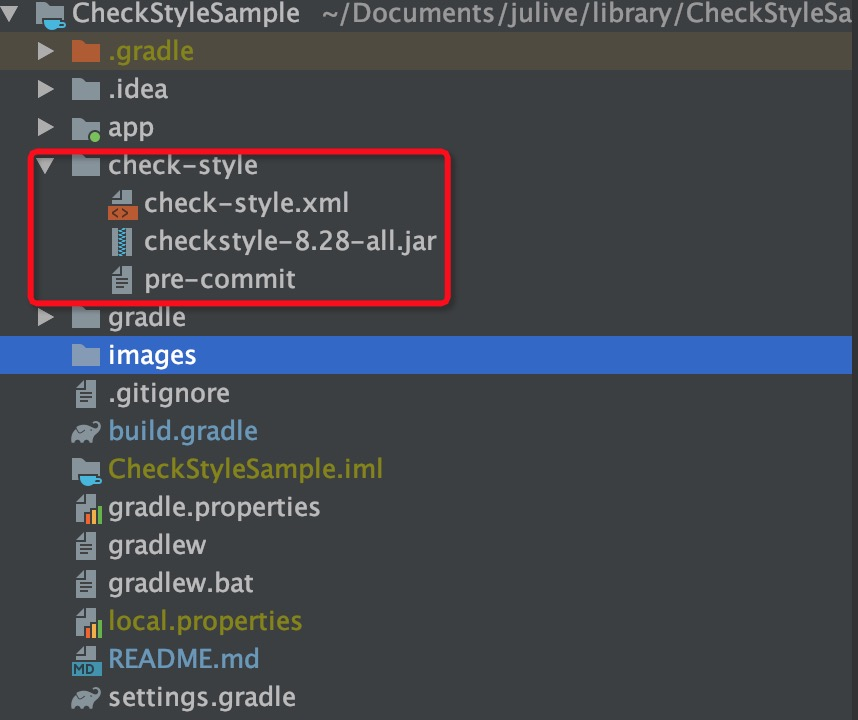
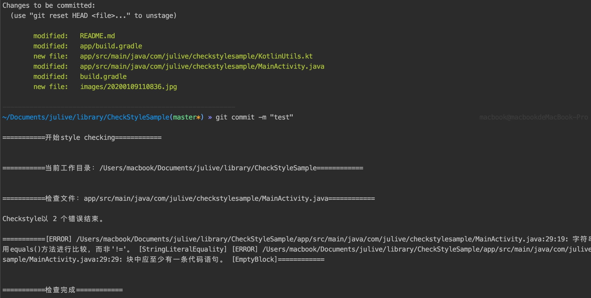
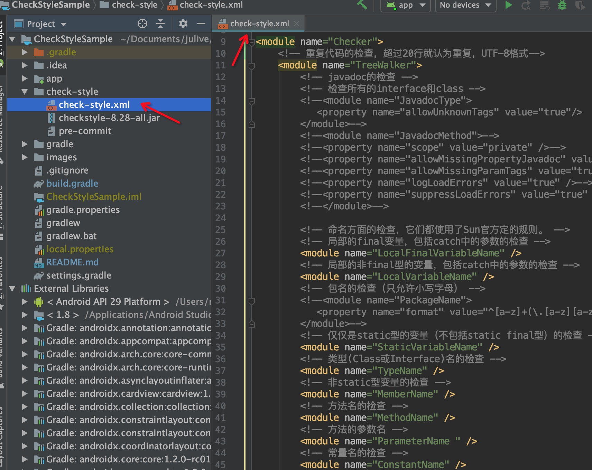

# CheckStyleSample
Auto scanning code for Java &amp; Android

[CheckStyle](https://checkstyle.org/)

[CheckStyle Github](https://github.com/checkstyle/checkstyle)

### Feature

Checkstyle is highly configurable and can be made to support almost any coding standard. An example configuration files are supplied supporting the [Sun Style](https://checkstyle.org/styleguides/sun-code-conventions-19990420/CodeConvTOC.doc.html), [Google Style](https://checkstyle.org/styleguides/google-java-style-20180523/javaguide.html). 	

> 摘自 checkstyle.org	                                                                                                   


- **Auto**  自动化 : 和 Git hook 结合无需手动点击触发，commit 前自动扫描。
- **Configurable** 高可配: 检测规则可简可繁，Google 和 Sun 的几百种规则自由组合还可以自定义。
- **Cheap** 低成本: 5 分钟配置，永久有效
- **Fast** 每次对比上次 Git 变化的增量 Java 文件做检查，快速高效。
- **Adaptable** 支持包含 Terminal Git 、 SourceTree 、AS Version Control 等任何形式的 Git 提交。


### Install





- Download check-style， Put your project root directory。

-  Terminal : 

  

  ```javascript
  cp ./check-style/pre-commit ./.git/hooks   
  ```

  

  ```javascript
  chmod 777 ./.git/hooks/pre-commit    
  ```

  

### Usage

- **Sample**




- **Jump check**

  ```javascript
  git commit -n -m "say something"
  ```

- **Configuration of rules**

​       **Modify** check-style/check-style.xml             

[Rule List](https://checkstyle.sourceforge.io/checks.html)

[Rule for Chinese](https://www.iteye.com/blog/zhangzuanqian-987121) 



### Knowledge involved

- Git
- Shell or Python for script

### FQA

```java

fatal: cannot run .git/hooks/pre-commit: No such file or directory 


```

git commit 遇到这个问题请检查 studio 配置操作文件时候右下角的选项 注意是 LF 和 字符集，注意区分 Windows 和 Mac OS


### Thanks

[CheckStyle](https://checkstyle.org/)

https://www.jianshu.com/p/de90ffbd53e9 

https://blog.csdn.net/cmmchenmm/article/details/82804267

https://www.jianshu.com/p/21d4cbe68a28


**Git hook gives you a door, how big your brain hole is, how big the world behind the door will be**